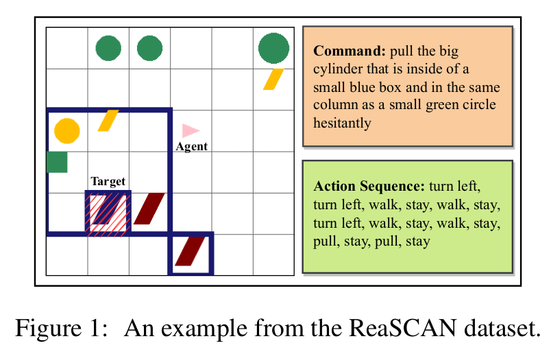

<h2 align="center">
  When Can Transformers Ground and Compose: Insights from Compositional Generalization Benchmarks
</h2>

<p align="center">
  <a href="https://2022.emnlp.org/"></a>
  <a href="https://github.com/ankursikarwar/Grounded-Compositional-Generalization/blob/main/LICENSE">
    
  </a>
</p>


<p align="justify">
Humans can reason compositionally whilst grounding language utterances to the real world. Recent benchmarks like <a href="https://arxiv.org/abs/2109.08994">ReaSCAN</a> use navigation tasks grounded in a grid world to assess whether neural models exhibit similar capabilities. In this work, we propose simple and well-motivated modifications to a multi-modal transformer model that outperforms specialized architectures on <a href="https://arxiv.org/abs/2109.08994">ReaSCAN</a> and a <a href="https://arxiv.org/abs/2109.12243">modified version</a> of <a href="https://arxiv.org/abs/2003.05161">gSCAN</a>. Moreover, we design a series of experiments to understand the underlying challenges in these tasks. We also demonstrate that the split, testing depth generalization in ReaSCAN is unfair because the training data does not contain sufficient information for the models to correctly choose amongst competing hypotheses. On experimenting with a modified training distribution, we show that simple transformer-based models can successfully generalize to commands with greater depths. We introduce a new simpler grounded compositional generalization task called <b>RefEx</b> to study how transformers ground and compose. Additionally, we conduct experiments to interpret, examine, and provide explicit constructions that show transformer's computations corresponding to grounding and composition in the RefEx task setting.
</p>

<br>
<p align="center">
</p>
<hr>

##### This repository contains two modules: reascan and refexp

#### Dependencies

- compatible with python 3.6
- dependencies can be installed using `code/reascan/requirements.txt`


#### Setup

Install VirtualEnv using the following (optional):

```shell
$ [sudo] pip install virtualenv
```

Create and activate your virtual environment (optional):

```shell
$ virtualenv -p python3 venv
$ source venv/bin/activate
```

Install all the required packages:

at `code/reascan/:`

```shell
$ pip install -r requirements.txt
```

For reascan module:

Download and extract ReaSCAN dataset in code/reascan/data/ReaSCAN-v1.1 from https://reascan.github.io/

Then to preprocess data, run following at code/reascan/src/utils/

```shell
$ python preprocess.py --dataset reascan
```

#### Usage:

The set of possible arguments available can be seen in the respective `args.py` file. Here, we illustrate training a model on reascan (similar usage for refexp):

at `code/reascan/:`

```
$ python src.main --mode train --test_split custom_comp --train_fname train.json --val_fname dev_comp_3500.json --load_config default_12_6_enc_dec_layers_interleave_co_self_reascan.json --run_name run_1 --batch_size 32 --gpu 0 --lr 0.0001 --epochs 100 --seed 3420
```

##### Note: Jupyter notebooks for generating custom splits based on ReaSCAN, gSCAN, and GSRR datasets are in code/reascan/

<!-- #### Citation -->

<!-- If you use our data or code, please cite our work:

```

``` -->

For any clarification, comments, or suggestions please contact [Ankur](mailto:ankursikarwardc@gmail.com) or [Arkil](http://arkilpatel.github.io/).
